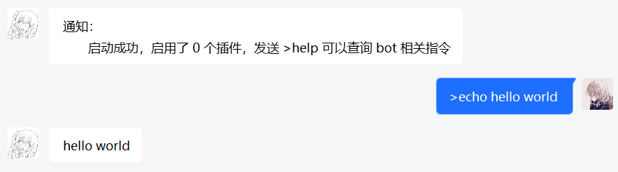

<div class="updated">{docsify-updated}</div>

?> 在此之前你需要安装并掌握 [nodejs](https://nodejs.org/) 及 [npmjs](https://www.npmjs.com/) 的相关知识

## 项目安装

本项目不用安装任何第三方软件，非常简单轻便，仅需三行命令即可构建

<!-- tabs:start -->

#### **全局安装**

``` shell
# 安装 kokkoro
npm i -g kokkoro

# 创建并进入文件夹
mkdir bot && cd bot

# 初始化项目
kokkoro init
```

#### **本地安装**

``` shell
# 创建并进入文件夹
mkdir bot && cd bot

# 安装 kokkoro
npm i kokkoro

# 初始化项目
npx kokkoro init
```

<!-- tabs:end -->

> 若网速较慢可以尝试使用阿里镜像源  
> `npm i -g kokkoro --registry=https://registry.npm.taobao.org`

~~yuki，你为什么不讲下用 yarn 如何安装呀？（这是给小白看的，你 npm 都会用了还需要讲 yarn 么）~~

## 目录结构

当你输入 `kokkoro init` 后， kokkoro 将会为你在当前所在目录自动安装并生成相关文件

``` text
.
├─ data                  资源目录
├─ plugins               插件目录（存放编写好的插件）
├─ index.js              程序入口
└─ kkrconfig.json        配置文件
```

!> 项目启动后尽量避免编辑器直接修改配置文件，你改了也不会生效的，使用 **指令修改** 可以立即生效

这个时候你可能就要说了，yuki 你个骗子，我看了目录明明生成了不止上面说的 4 个文件

别急，kokkoro 确实只会生成上面的 4 个文件  
其它例如 `node_modules`、`package.json` 等都是 npm 生成的  
如果你不准备开发插件就不用关心这些**依赖文件**，后面在插件开发中会讲到，你也可以百度搜索相关知识

## 启动程序

一切准备就绪，开始启动你的项目吧

``` shell
kokkoro start
```

如果你是使用的本地安装，就要使用 `npx kokkoro start` 启动项目

> 如上述步骤无误，根据控制台的提示扫码或输入密码即可成功登录  
> 账号登录成功后，会在 `data/bots`目录下自动生成 QQ 账号的缓存及相关配置文件

## 你好世界

登录成功后，你将会收到一条私信（你填写的 masters）
输入 `>echo` 指令可以测试消息打印，现在开启一段属于你的物语吧 q(≧▽≦q)


  
> 当然，如果你有 js 的相关知识，随时都可以编写自己的插件，详情可在 [开发](/develop/example) 一栏查看  
> 更多插件和使用说明可以在 [插件社区](/plugin/awesome) 中查找，不过文档不一定及时更新，你也可以访问 [GitHub](https://github.com/kokkorojs) 仓库