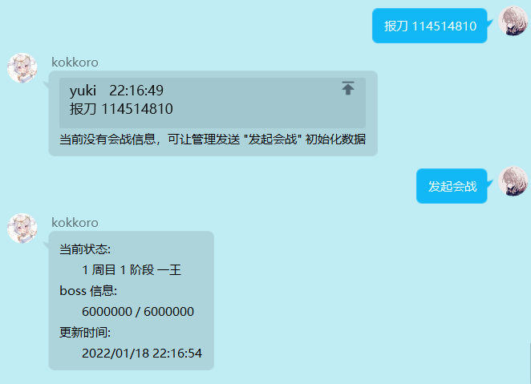
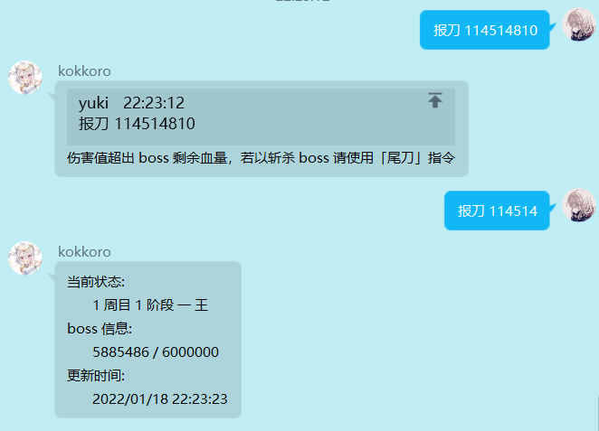
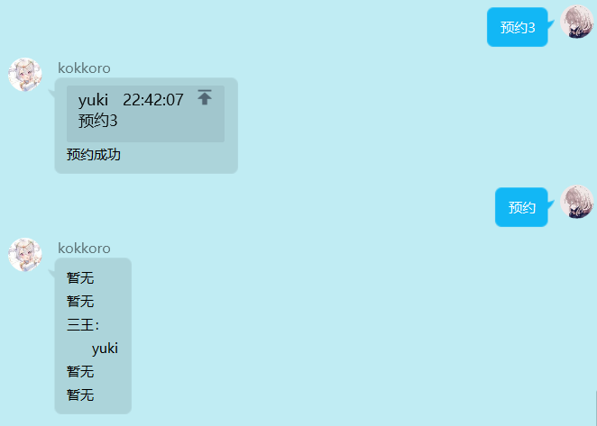
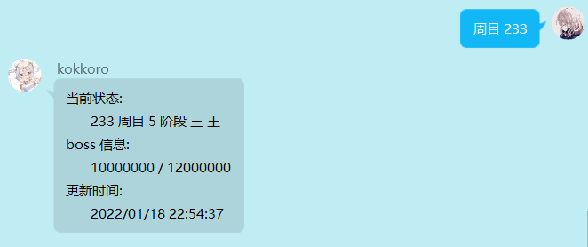

!> 因时间有限，该页面无法保证与 Github 仓库同步更新，插件基本使用在相关仓库 README 有说明  
这里仅给出部分插件的图片演示，不定时更新，若要访问全部插件可 [点击查找](https://github.com/kokkorojs)

## 群管理
```bash
npm i kokkoro-plugin-group
```

群管插件，有各种各样的例如成员退群提醒、申请头衔等小功能

### 默认参数
```typescript
interface GroupOption {
  // 群通知
  notice: boolean;
  // 申请头衔等级限制
  title_level: number;
}
```

### 申请头衔
> 申请头衔相关正则 `/^申请头衔[\s]?.+$/`

## 公会助手

```bash
npm i kokkoro-plugin-guild
```

原名 kokkoro-gvg ，作为会战的报刀专用插件，因为后续会扩展一系列基于公会的非会战功能，所以改名

### 会战功能

> 在使用会战功能前，若你从未设置过公会信息，则需要先修改当前游戏服务器

### 默认参数

```javascript
const option = {
  // 游戏服务器
  server: 'none',
}
```
server 默认参数为 `none` ，可选 `bl`、`tw`、`jp`，对应`国服`、`台服`、`日服`，你可以使用 `>guild server bl` 设置国服公会，也能直接输入 `设置国服公会` 修改

### 设置公会

> 设置公会的相关正则 `/^设置(国|台|日)服(公|工)会$/`


一般你只用设置一次游戏服务器，如果要中途修改重新设置一次就行了，在一切准备就绪后你就可以开启当期会战

### 发起会战

> 开启会战的相关正则 `/^(开启|发起)会战$/`



当前演示为国服，kokkoro 支持日服会战，样式会有些许不一样，不过操作逻辑都是相同的

会战开启后无需手动关闭，在 3 天内没任何报刀的情况下会自动结束，若开启会战仅仅是为了测试，可以输入 `中止会战` 来关闭当前会战

!> 请注意该操作不可逆，中止会战将会 **删除** 本轮会战的所有数据

### 伤害记录

> 报刀的相关正则 `/(^[1-5]?\s?(报刀|连报)\s?[1-9]\d*$|^[1-5]?\s?尾刀$)/`



发送 `报刀 <伤害>` 即可记录出刀数据，若斩杀 boss ，则需要输入 `尾刀` 而不是报刀，不必传递其它参数

如果你是日服公会，在 `报刀` 前面输入 boss 编号可指定对应 boss ，例如 `2 报刀 3000000` 或 `5 尾刀`，若未指定 boss 则与国服逻辑保持一致，会默认指定当前第一个存活的 boss  
如果你有多个小号，在当前已报完三刀的情况下，可以输入 `连报` 无视出刀数量限制

### 出刀代报

> 代报的相关正则 `/^@.*\s?[1-5]?\s?代报\s?\d*$/`

如果有公会成员出刀忘了报，可以使用代报指令，格式为 `@xxx 代报 100000`，若斩杀 boss ，**不输入伤害数值** 默认尾刀


### 预约提醒

> 预约的相关正则 `/^\*?预约[\s]?[1-5]?$/`



发送预约可查看当前预约信息，若需要预约 boss ，输入 `预约 <boss 编号>` 将会在上一个 boss 被斩杀时收到 At 提示


在预约收到 at 消息后，将会清空该 boss 下所有的预约成员信息，如果想让自己常驻预约，可以在指令前面添加 `*` 号让预约持久化


输入 `取消预约 <boss 编号>` 将自己移出预约列表

日服公会无法使用预约功能，在斩杀所有 boss 跳周目后会直接 at 全体成员

### 状态修改

> 状态修改的相关正则 `/^((周目|boss|血量)\s?([1-9]\d*|0)\s?){1,3}$/`

若有成员不小心报错了刀，你可以直接修改当前的会战进入和任意的 boss 状态

例如 `周目 1 boss 1 血量 6000000`，以上参数并非全部必填项，若只需要修改周目数单独输入指令即可



### 会战查询

输入 `查询排名 <公会名> <会长名>` 可以查询公会的当前排名，会长名非必填，若不指定会长则默认发送前 3 条同名公会数据

输入 `分数线` 可以查看当前会战分数线

!> _TODO_