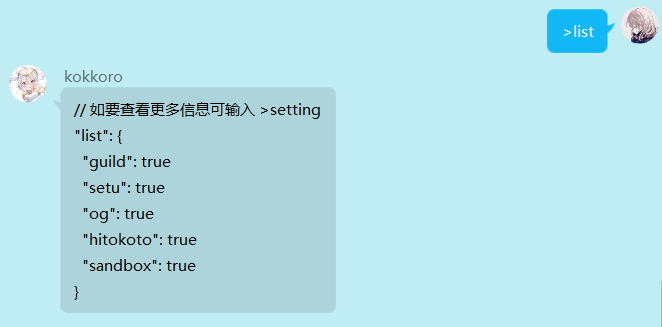

?> kokkoro 主要以 [公主连结☆Re:Dive](https://priconne-redive.jp/) 玩家为核心开发相关插件

## 指令介绍

插件针对不同群聊都有着各自的参数设定，互不干扰，在群内输入 `>list` 列出 bot 在该群聊可使用的所有插件

你可以输入指令 `><插件名>` 来查看该插件的所有设置，管理员和群主能修改插件的任意属性 ~~（不要修改一些奇怪的东西进去，程序崩了我不负责）~~

当然，修改属性也特别简单，使用 `><插件名> <插件属性> <修改参数>` 指令即可立即生效

> 所有插件默认都会有 `apply` 与 `lock` 这两个属性，不可删除  
> 其它的属性都是在编写插件时导出 `default_option` 对象设置的

`apply` 是插件的应用属性，如果将该属性改为 false ，插件将不在监听该群聊的相关信息

例如你可以使用 `>setu apply false` 让群内的 lsp 禁止色色

更多插件和使用说明可以在 [插件社区](/plugin/awesome) 中查找，不过文档不一定及时更新，你也可以访问 [GitHub](https://github.com/kokkorojs) 仓库